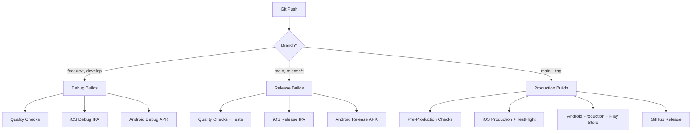

# 🚀 ReservApp Mobile - Guía Completa de Deployment

## 📋 Índice
- [CI/CD System Overview](#cicd-system-overview)
- [Fastlane Configuration](#fastlane-configuration)
- [GitHub Actions Workflows](#github-actions-workflows)
- [iOS Deployment](#ios-deployment)
- [Android Deployment](#android-deployment)
- [Icon Setup & Assets](#icon-setup--assets)
- [Testing Flows](#testing-flows)
- [Store Preparation](#store-preparation)
- [Production Release](#production-release)

---

## 🏗️ CI/CD System Overview

### Sistema Completo con Fastlane y GitHub Actions



### Flujo de Deployment
```
Development → Testing → Staging → Production → Store Release
     ↓           ↓        ↓           ↓           ↓
  Debug APK   Release    AdHoc      TestFlight   App Store
  Debug IPA     APK      IPA        Internal     Google Play
```

---

## ⚙️ Fastlane Configuration

### Estructura de Archivos
```
fastlane/
├── Fastfile              # Lanes y configuración principal
├── Appfile               # Configuración de app (iOS/Android)
├── Matchfile             # Configuración de certificados iOS
├── Gymfile               # Configuración de build iOS
├── Scanfile              # Configuración de tests
└── Pluginfile            # Plugins instalados
```

### Fastfile - Lanes Principales

#### iOS Lanes
```ruby
# Debug Build
lane :debug_ios do
  increment_build_number(xcodeproj: "ios/ReservApp.xcodeproj")
  gym(
    scheme: "ReservApp",
    configuration: "Debug",
    export_method: "development",
    output_directory: "./builds/ios/debug",
    clean: true
  )
end

# Release Build
lane :release_ios do
  increment_build_number(xcodeproj: "ios/ReservApp.xcodeproj")
  gym(
    scheme: "ReservApp",
    configuration: "Release", 
    export_method: "ad-hoc",
    output_directory: "./builds/ios/release",
    clean: true
  )
end

# Production Build + TestFlight
lane :production_ios do
  # Increment version
  increment_version_number(
    xcodeproj: "ios/ReservApp.xcodeproj",
    bump_type: "patch"
  )
  increment_build_number(xcodeproj: "ios/ReservApp.xcodeproj")
  
  # Match certificates
  match(type: "appstore", readonly: true)
  
  # Build
  gym(
    scheme: "ReservApp",
    configuration: "Release",
    export_method: "app-store",
    clean: true
  )
  
  # Upload to TestFlight
  pilot(
    skip_waiting_for_build_processing: false,
    apple_id: ENV["APPLE_ID"],
    app_identifier: "com.reservapp.mobile"
  )
end
```

#### Android Lanes
```ruby
# Debug Build
lane :debug_android do
  gradle(
    task: "assembleDebug",
    project_dir: "android/",
    properties: {
      "android.injected.signing.store.file" => "debug.keystore",
      "android.injected.signing.store.password" => "android",
    }
  )
end

# Release Build  
lane :release_android do
  gradle(
    task: "assembleRelease",
    project_dir: "android/",
    properties: {
      "android.injected.signing.store.file" => ENV["ANDROID_KEYSTORE_FILE"],
      "android.injected.signing.store.password" => ENV["ANDROID_KEYSTORE_PASSWORD"],
    }
  )
end

# Production Build + Play Store
lane :production_android do
  # Version bump
  android_set_version_code(
    gradle_file: "android/app/build.gradle"
  )
  
  # Build AAB
  gradle(
    task: "bundleRelease",
    project_dir: "android/"
  )
  
  # Upload to Play Store
  upload_to_play_store(
    track: "internal",
    aab: "android/app/build/outputs/bundle/release/app-release.aab",
    json_key: ENV["GOOGLE_PLAY_JSON_KEY_FILE"]
  )
end
```

#### Combined Lanes
```ruby
# All debug builds
lane :debug_all do
  debug_ios
  debug_android
  
  # Notify team
  slack(
    message: "🛠️ Debug builds completed",
    channel: "#mobile-builds"
  )
end

# All release builds
lane :release_all do
  release_ios
  release_android
  
  slack(
    message: "🚀 Release builds completed", 
    channel: "#mobile-builds"
  )
end

# All production builds
lane :production_all do
  production_ios
  production_android
  
  slack(
    message: "🎉 Production builds deployed to stores!",
    channel: "#mobile-builds"
  )
end
```

### Appfile Configuration
```ruby
# iOS
app_identifier("com.reservapp.mobile")
apple_id("team@reservapp.com") 
team_id("XXXXXXXXXX")

# Android
package_name("com.reservapp.mobile")
json_key_file("path/to/google-play-key.json")
```

---

## 🤖 GitHub Actions Workflows

### 1. Debug Builds Workflow
```yaml
# .github/workflows/debug-builds.yml
name: 🛠️ Debug Builds

on:
  push:
    branches: [develop, 'feature/*']
  pull_request:
    branches: [develop, main]

jobs:
  quality-checks:
    runs-on: ubuntu-latest
    steps:
      - uses: actions/checkout@v4
      - uses: actions/setup-node@v4
        with:
          node-version: '18'
          cache: 'yarn'
      
      - name: Install dependencies
        run: yarn install --frozen-lockfile
      
      - name: TypeScript check
        run: yarn type-check
      
      - name: ESLint check
        run: yarn lint --max-warnings 0
      
      - name: Test suite
        run: yarn test --coverage

  debug-ios:
    needs: quality-checks
    runs-on: macos-latest
    steps:
      - uses: actions/checkout@v4
      - uses: actions/setup-node@v4
        with:
          node-version: '18'
          cache: 'yarn'
      
      - name: Install dependencies
        run: yarn install --frozen-lockfile
      
      - name: Setup Ruby
        uses: ruby/setup-ruby@v1
        with:
          ruby-version: '3.0'
          bundler-cache: true
          working-directory: ios
      
      - name: Install CocoaPods
        run: cd ios && bundle exec pod install
      
      - name: Build iOS Debug
        run: bundle exec fastlane debug_ios
        env:
          MATCH_PASSWORD: ${{ secrets.MATCH_PASSWORD }}
      
      - name: Upload iOS artifact
        uses: actions/upload-artifact@v4
        with:
          name: ios-debug-build
          path: builds/ios/debug/*.ipa

  debug-android:
    needs: quality-checks
    runs-on: ubuntu-latest
    steps:
      - uses: actions/checkout@v4
      - uses: actions/setup-node@v4
        with:
          node-version: '18'
          cache: 'yarn'
      
      - name: Setup Java
        uses: actions/setup-java@v4
        with:
          distribution: 'temurin'
          java-version: '17'
      
      - name: Setup Android SDK
        uses: android-actions/setup-android@v3
      
      - name: Install dependencies
        run: yarn install --frozen-lockfile
      
      - name: Build Android Debug
        run: bundle exec fastlane debug_android
      
      - name: Upload Android artifact
        uses: actions/upload-artifact@v4
        with:
          name: android-debug-build
          path: android/app/build/outputs/apk/debug/*.apk
```

### 2. Release Builds Workflow
```yaml
# .github/workflows/release-builds.yml
name: 🚀 Release Builds

on:
  push:
    branches: [main]
    paths-ignore:
      - '**.md'
      - 'docs/**'

jobs:
  release-builds:
    runs-on: macos-latest
    steps:
      - uses: actions/checkout@v4
      
      - name: Setup environment
        uses: ./.github/actions/setup-environment
      
      - name: Quality gates
        run: |
          yarn type-check
          yarn lint --max-warnings 0
          yarn test --coverage --passWithNoTests
      
      - name: Build iOS Release
        run: bundle exec fastlane release_ios
        env:
          MATCH_PASSWORD: ${{ secrets.MATCH_PASSWORD }}
      
      - name: Build Android Release
        run: bundle exec fastlane release_android
        env:
          ANDROID_KEYSTORE_PASSWORD: ${{ secrets.ANDROID_KEYSTORE_PASSWORD }}
      
      - name: Upload artifacts
        uses: actions/upload-artifact@v4
        with:
          name: release-builds
          path: |
            builds/ios/release/*.ipa
            android/app/build/outputs/apk/release/*.apk
          retention-days: 30
```

### 3. Production Builds Workflow
```yaml
# .github/workflows/production-builds.yml
name: 🎉 Production Deployment

on:
  push:
    tags:
      - 'v*.*.*'

jobs:
  production-deploy:
    runs-on: macos-latest
    environment: production
    steps:
      - uses: actions/checkout@v4
      
      - name: Setup environment
        uses: ./.github/actions/setup-environment
      
      - name: Pre-production checks
        run: |
          yarn type-check
          yarn lint --max-warnings 0
          yarn test --coverage --passWithNoTests
          ./scripts/pre-production-checks.sh
      
      - name: Deploy to Production
        run: bundle exec fastlane production_all
        env:
          MATCH_PASSWORD: ${{ secrets.MATCH_PASSWORD }}
          ANDROID_KEYSTORE_PASSWORD: ${{ secrets.ANDROID_KEYSTORE_PASSWORD }}
          GOOGLE_PLAY_JSON_KEY_FILE: ${{ secrets.GOOGLE_PLAY_JSON_KEY_FILE }}
          APPLE_ID: ${{ secrets.APPLE_ID }}
          FASTLANE_APPLE_APPLICATION_SPECIFIC_PASSWORD: ${{ secrets.APPLE_APP_PASSWORD }}
      
      - name: Create GitHub Release
        uses: actions/create-release@v1
        env:
          GITHUB_TOKEN: ${{ secrets.GITHUB_TOKEN }}
        with:
          tag_name: ${{ github.ref }}
          release_name: ReservApp Mobile ${{ github.ref }}
          draft: false
          prerelease: false
```

---

## 🍎 iOS Deployment

### Apple Developer Account Setup

#### 1. Certificates & Provisioning
```bash
# Setup Match for certificate management
fastlane match init

# Generate certificates
fastlane match development
fastlane match appstore
```

#### 2. App Store Connect Configuration
- **App Information**: Bundle ID, SKU, Primary Language
- **Pricing & Availability**: Free app, All territories
- **App Privacy**: Data collection disclosures
- **App Review Information**: Contact details, notes

#### 3. TestFlight Configuration
- **Internal Testing**: Team members and stakeholders
- **External Testing**: Beta testers group
- **Beta App Review**: Required for external testing

### Build Configuration

#### Info.plist Settings
```xml
<key>CFBundleDisplayName</key>
<string>ReservApp</string>
<key>CFBundleIdentifier</key>
<string>com.reservapp.mobile</string>
<key>CFBundleVersion</key>
<string>$(CURRENT_PROJECT_VERSION)</string>
<key>NSAppTransportSecurity</key>
<dict>
  <key>NSAllowsArbitraryLoads</key>
  <false/>
</dict>
```

#### Build Settings
- **Deployment Target**: iOS 12.0
- **Architectures**: arm64, x86_64 (simulator)
- **Code Signing**: Automatic signing
- **Bitcode**: Enabled

---

## 🤖 Android Deployment

### Google Play Console Setup

#### 1. App Configuration
- **App Details**: Title, Short description, Full description
- **Graphics**: Icon, Feature graphic, Screenshots
- **Categorization**: Business category, Content rating
- **Contact Details**: Website, email, privacy policy

#### 2. Release Management
- **Internal Testing**: Closed testing for team
- **Open Testing**: Public beta (optional)
- **Production**: Live release

### Build Configuration

#### build.gradle Settings
```gradle
android {
    compileSdk 34
    namespace "com.reservapp.mobile"
    
    defaultConfig {
        applicationId "com.reservapp.mobile"
        minSdk 21
        targetSdk 34
        versionCode 1
        versionName "1.0.0"
    }
    
    signingConfigs {
        release {
            storeFile file(MYAPP_UPLOAD_STORE_FILE)
            storePassword MYAPP_UPLOAD_STORE_PASSWORD
            keyAlias MYAPP_UPLOAD_KEY_ALIAS
            keyPassword MYAPP_UPLOAD_KEY_PASSWORD
        }
    }
    
    buildTypes {
        release {
            minifyEnabled true
            proguardFiles getDefaultProguardFile('proguard-android-optimize.txt'), 'proguard-rules.pro'
            signingConfig signingConfigs.release
        }
    }
}
```

#### Keystore Generation
```bash
# Generate release keystore
keytool -genkeypair -v -storetype PKCS12 \
  -keystore reservapp-release.keystore \
  -alias reservapp-key \
  -keyalg RSA \
  -keysize 2048 \
  -validity 10000
```

---

## 🎨 Icon Setup & Assets

### Icon Generation Script
```javascript
// scripts/generate-icons.js
const sharp = require('sharp');
const fs = require('fs');
const path = require('path');

const ICON_SIZES = {
  ios: [
    { size: 20, scale: [1, 2, 3] },
    { size: 29, scale: [1, 2, 3] },
    { size: 40, scale: [1, 2, 3] },
    { size: 60, scale: [2, 3] },
    { size: 76, scale: [1, 2] },
    { size: 83.5, scale: [2] },
    { size: 1024, scale: [1] }
  ],
  android: [
    { density: 'mdpi', size: 48 },
    { density: 'hdpi', size: 72 },
    { density: 'xhdpi', size: 96 },
    { density: 'xxhdpi', size: 144 },
    { density: 'xxxhdpi', size: 192 }
  ]
};

async function generateIcons() {
  const sourceIcon = 'assets/icon-source.png';
  
  // iOS Icons
  for (const iconSize of ICON_SIZES.ios) {
    for (const scale of iconSize.scale) {
      const size = iconSize.size * scale;
      const filename = `icon-${iconSize.size}@${scale}x.png`;
      
      await sharp(sourceIcon)
        .resize(size, size)
        .png()
        .toFile(`ios/ReservApp/Images.xcassets/AppIcon.appiconset/${filename}`);
    }
  }
  
  // Android Icons
  for (const iconSize of ICON_SIZES.android) {
    const filename = `ic_launcher.png`;
    const outputPath = `android/app/src/main/res/mipmap-${iconSize.density}/${filename}`;
    
    await sharp(sourceIcon)
      .resize(iconSize.size, iconSize.size)
      .png()
      .toFile(outputPath);
  }
  
  console.log('✅ Icons generated successfully!');
}

generateIcons().catch(console.error);
```

### Asset Preparation Checklist

#### App Store Assets (iOS)
- [ ] App Icon (1024x1024)
- [ ] iPhone Screenshots (6.7", 6.5", 5.5")
- [ ] iPad Screenshots (12.9", 11")
- [ ] App Previews (optional videos)

#### Google Play Assets (Android)
- [ ] App Icon (512x512)
- [ ] Feature Graphic (1024x500)
- [ ] Phone Screenshots (16:9, 9:16 ratios)
- [ ] Tablet Screenshots (optional)
- [ ] TV Banner (optional)

#### Required Documents
- [ ] Privacy Policy URL
- [ ] Terms of Service URL  
- [ ] Support URL
- [ ] Marketing URL (optional)

---

## 🧪 Testing Flows

### Comprehensive Testing Guide

#### 1. Pre-Build Testing
```bash
#!/bin/bash
# scripts/pre-build-tests.sh

echo "🧪 Running pre-build tests..."

# TypeScript compilation
echo "Checking TypeScript..."
yarn type-check

# Linting
echo "Running ESLint..."
yarn lint --max-warnings 0

# Unit tests
echo "Running unit tests..."
yarn test --coverage --passWithNoTests

# Bundle analysis
echo "Analyzing bundle size..."
yarn bundle-analyzer

echo "✅ Pre-build tests completed!"
```

#### 2. Manual Testing Checklist

**Authentication Flow**
- [ ] Login with valid credentials
- [ ] Login with invalid credentials
- [ ] Password reset flow
- [ ] Session restoration
- [ ] Logout functionality

**Reservation Flow**
- [ ] Venue discovery and search
- [ ] Service selection
- [ ] Date/time selection
- [ ] Guest information
- [ ] Payment process
- [ ] Reservation confirmation

**Profile Management**
- [ ] View profile information
- [ ] Edit profile details
- [ ] Upload profile image
- [ ] Change password
- [ ] Notification settings

**Reservations Management**
- [ ] View reservations list
- [ ] Filter reservations
- [ ] Cancel reservation
- [ ] Rate completed service
- [ ] Reservation details

#### 3. Device Testing Matrix

**iOS Testing**
- [ ] iPhone SE (iOS 15+)
- [ ] iPhone 12/13 (iOS 16+)
- [ ] iPhone 14/15 (iOS 17+)
- [ ] iPad (iPadOS 15+)

**Android Testing**  
- [ ] Android 8.0 (API 26)
- [ ] Android 10.0 (API 29)
- [ ] Android 12.0 (API 31)
- [ ] Android 14.0 (API 34)

#### 4. Performance Testing
```bash
# Performance testing script
#!/bin/bash

echo "📊 Running performance tests..."

# Bundle size check
BUNDLE_SIZE=$(yarn bundle-size | grep "Total size")
echo "Bundle size: $BUNDLE_SIZE"

# Memory usage profiling
yarn profile:memory

# Cold start time measurement  
yarn profile:startup

# Navigation performance
yarn profile:navigation

echo "✅ Performance tests completed!"
```

---

## 🏪 Store Preparation

### App Store Submission Checklist

#### App Information
- [ ] App name and subtitle
- [ ] App description (up to 4000 characters)
- [ ] Keywords (up to 100 characters)
- [ ] Support URL
- [ ] Marketing URL (optional)
- [ ] Privacy Policy URL

#### Pricing & Availability
- [ ] Price: Free
- [ ] Territories: All countries
- [ ] App Store distribution

#### App Review Information  
- [ ] Contact information
- [ ] Demo account (if required)
- [ ] Review notes
- [ ] Attachment files (if needed)

#### Version Information
- [ ] Version number (1.0.0)
- [ ] What's new in this version
- [ ] Copyright information
- [ ] Build selection from TestFlight

### Google Play Submission Checklist

#### Store Listing
- [ ] App title (30 characters)
- [ ] Short description (80 characters)  
- [ ] Full description (4000 characters)
- [ ] App category: Business
- [ ] Content rating questionnaire

#### App Content
- [ ] Privacy Policy URL
- [ ] Ads declaration
- [ ] Target audience
- [ ] News app declaration (No)

#### Pricing & Distribution
- [ ] Price: Free
- [ ] Countries: All available
- [ ] Device categories: All supported

---

## 🚀 Production Release

### Release Process

#### 1. Pre-Release Preparation
```bash
#!/bin/bash
# scripts/prepare-release.sh

echo "🚀 Preparing production release..."

# Version bump
npm version patch

# Update changelog
echo "## Version $(node -p "require('./package.json').version")" >> CHANGELOG.md
git add CHANGELOG.md

# Final quality checks
yarn type-check
yarn lint --max-warnings 0
yarn test --coverage

# Build verification
yarn build:verify

echo "✅ Release preparation completed!"
```

#### 2. Release Deployment
```bash
# Deploy to production
git tag v$(node -p "require('./package.json').version")
git push origin main --tags

# This triggers the production workflow
# which will:
# 1. Build production versions
# 2. Upload to TestFlight (iOS)
# 3. Upload to Play Console (Android)
# 4. Create GitHub release
```

#### 3. Post-Release Monitoring
- [ ] Monitor crash reports
- [ ] Track user feedback
- [ ] Monitor performance metrics
- [ ] Check store rankings
- [ ] Respond to user reviews

### Release Notes Template
```markdown
## Version X.Y.Z

### 🎉 New Features
- Feature description

### 🐛 Bug Fixes  
- Bug fix description

### ⚡ Improvements
- Improvement description

### 🔧 Technical
- Technical change description
```

---

## 🛠️ Troubleshooting

### Common Issues & Solutions

#### iOS Build Issues
```bash
# Clean iOS build
cd ios
rm -rf build/
rm -rf ~/Library/Developer/Xcode/DerivedData/*
bundle exec pod install --repo-update

# Reset Metro cache
yarn start --reset-cache
```

#### Android Build Issues
```bash
# Clean Android build
cd android
./gradlew clean
./gradlew cleanBuildCache

# Reset Metro cache
yarn start --reset-cache
```

#### Certificate Issues (iOS)
```bash
# Reset certificates
fastlane match nuke development
fastlane match nuke distribution
fastlane match development
fastlane match appstore
```

#### Fastlane Issues
```bash
# Update Fastlane
bundle update fastlane

# Clear Fastlane cache
rm -rf ~/.fastlane/spaceship/
```

---

## 📜 Scripts Reference - Comandos Disponibles

### 📱 **Desarrollo & Testing**

#### Desarrollo Básico
```bash
# Iniciar Metro bundler
yarn start
yarn start:reset          # Reiniciar con caché limpio

# Ejecutar en dispositivos
yarn android              # Android (debug por defecto)
yarn android:debug        # Android debug explícito
yarn android:release      # Android release
yarn ios                  # iOS (debug por defecto)  
yarn ios:debug           # iOS debug explícito
yarn ios:release         # iOS release
```

#### Testing
```bash
# Tests básicos
yarn test                 # Ejecutar todos los tests
yarn test:watch          # Ejecutar tests en modo watch
yarn test:coverage       # Ejecutar tests con coverage
yarn test:ci             # Tests para CI/CD (sin watch)

# Tests específicos
yarn test:integration    # Tests de integración
yarn test:performance    # Tests de rendimiento
```

### 🔨 **Construcción & Builds**

#### Builds Combinados
```bash
yarn build               # Build release completo (iOS + Android)
```

#### Builds Android
```bash
# APK Builds
yarn build:android              # Release APK (principal)
yarn build:android:debug        # Debug APK
yarn build:android:release      # Release APK (explícito)

# Android App Bundle (para Play Store)
yarn build:android:bundle       # Release AAB
```

#### Builds iOS
```bash
# Builds básicos
yarn build:ios                  # Release build
yarn build:ios:debug           # Debug archive
yarn build:ios:release         # Release archive

# IPA generation
yarn build:ios:ipa             # Generar IPA desde archive
```

### 🧹 **Limpieza & Mantenimiento**

#### Limpieza Selectiva
```bash
yarn clean:cache              # Solo caché de Metro
yarn clean:builds            # Solo archivos de build
yarn clean:modules           # Solo node_modules
yarn clean:ios               # Solo archivos iOS
yarn clean:android           # Solo archivos Android
```

#### Limpieza Completa
```bash
yarn clean                   # Limpieza general (cache + builds + modules)
yarn clean:all              # Limpieza total (incluye iOS + Android)
```

### 📦 **Dependencias**

#### iOS (CocoaPods)
```bash
yarn pods                    # Instalar pods
yarn pods:update            # Actualizar pods
yarn pods:repo-update       # Actualizar repositorio + pods
```

### ✅ **Linting & Calidad**

#### Linting Completo
```bash
yarn lint                    # Lint completo (JS + CSS + TypeScript)
yarn lint:fix               # Auto-fix todos los problemas
yarn lint:fix-safe          # Fix solo sin warnings
yarn lint:fix-all           # Fix + type-check
```

#### Linting Específico
```bash
# JavaScript/TypeScript
yarn lint:js                # Solo ESLint
yarn lint:errors:js        # Solo errores (sin warnings)

# CSS/Styles  
yarn lint:styles            # Solo Stylelint
yarn lint:errors:styles    # Solo errores de estilos

# Por directorio
yarn lint:hooks            # Solo hooks
yarn lint:components       # Solo componentes
yarn lint:services         # Solo servicios
yarn lint:screens          # Solo screens
yarn lint:modules          # Solo módulos
```

#### Herramientas Adicionales
```bash
# Performance
yarn lint:performance      # Análisis de tiempo de linting
yarn lint:staged           # Para pre-commit hooks

# Formateo
yarn format                # Auto-formatear código
yarn format:check          # Solo verificar formato
yarn prettier              # Verificar Prettier
yarn prettier:fix          # Auto-fix Prettier
```

### 🔍 **Análisis de Código**

```bash
yarn analyze:exports        # Contar default exports
yarn analyze:console        # Contar console statements  
yarn analyze:unused         # Módulos no utilizados
yarn analyze:bundle         # Análisis de bundle Android
```

### 📝 **TypeScript**

```bash
yarn type-check             # Verificación de tipos
yarn type-check:watch      # Verificación en modo watch
```

### 🚀 **Despliegue & CI/CD**

#### Git Hooks
```bash
yarn pre-commit            # Verificaciones pre-commit
yarn pre-push              # Verificaciones pre-push
```

#### APK Direct Deploy
```bash
yarn deploy:apk:debug      # Generar APK debug + mensaje ubicación
yarn deploy:apk:release    # Generar APK release + mensaje ubicación
yarn deploy:bundle:release # Generar AAB release + mensaje ubicación
```

#### Fastlane iOS
```bash
yarn fastlane:ios:beta     # Deploy a TestFlight
yarn fastlane:ios:release  # Deploy a App Store

# Alias convenientes
yarn deploy:ios:testflight # = fastlane:ios:beta
yarn deploy:ios:appstore   # = fastlane:ios:release
```

#### Fastlane Android
```bash
yarn fastlane:android:beta     # Deploy a Play Store (beta)
yarn fastlane:android:release  # Deploy a Play Store (release)

# Alias convenientes  
yarn deploy:android:playstore:beta    # = fastlane:android:beta
yarn deploy:android:playstore:release # = fastlane:android:release
```

#### Setup Fastlane
```bash
yarn fastlane:setup        # Instalar dependencias Fastlane
```

### 🔒 **Seguridad**

```bash
yarn security:audit        # Auditoría de dependencias
yarn security:fix         # Auto-fix vulnerabilidades
```

### 🩺 **Diagnóstico**

```bash
yarn doctor                # React Native Doctor
yarn info                 # Información del entorno
yarn link                 # Enlazar dependencias nativas
yarn unlink              # Desenlazar dependencias nativas
```

### 📋 **Ejemplos de Workflows Comunes**

#### Desarrollo Diario
```bash
# Iniciar desarrollo
yarn start:reset
yarn android  # o yarn ios

# Verificar calidad antes de commit
yarn lint:fix-all
yarn test
```

#### Build para Testing
```bash
# Debug builds rápidos
yarn deploy:apk:debug
yarn fastlane:ios:beta
```

#### Release Production
```bash
# Builds completos con tests
yarn deploy:bundle:release
yarn deploy:ios:appstore
```

#### Limpieza Profunda
```bash
# Cuando hay problemas
yarn clean:all
yarn pods:repo-update
yarn start:reset
```

### 🎯 **Scripts Destacados vs Web Project**

✅ **Estandarizados con Web:**
- Linting completo con mismas reglas
- Scripts de análisis de código
- Formateo y pre-commit hooks
- Estructura de testing

🆕 **Específicos de Mobile:**
- Builds nativas (APK, IPA, AAB)
- Gestión de CocoaPods
- Integración Fastlane completa
- Despliegues automáticos a stores

### ⚙️ **Variables de Entorno**

#### Fastlane
- `SLACK_WEBHOOK_URL` - Webhook para notificaciones Slack

#### Build
- Variables definidas en `android/gradle.properties`
- Variables definidas en iOS build settings

**📚 Para más detalles:**
- `fastlane lanes` - Ver todas las lanes disponibles
- `yarn run` - Ver todos los scripts npm disponibles
- Consultar la sección Fastlane de esta guía para lanes específicas

---

Esta guía de deployment proporciona todo lo necesario para llevar ReservApp Mobile desde el desarrollo hasta las tiendas de aplicaciones con un proceso automatizado y profesional.